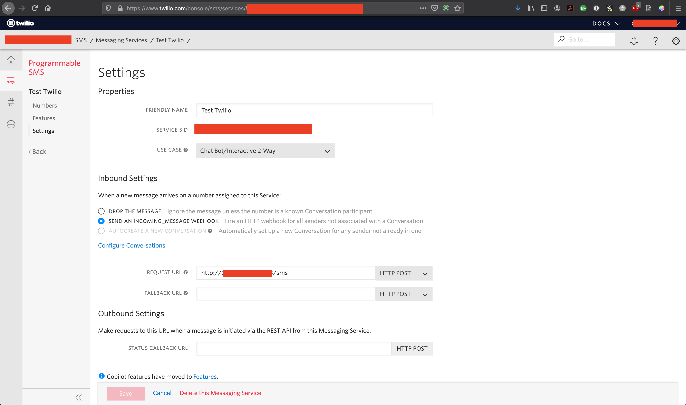

# rsf-twilio-bot

Commands

Build Typescript
```
npm run build
```

Build Typescript and "watch" (keep rebuilding when files change)
```
npm run build-watch
```

Start the server
```
npm start
```

## Explanation

When you set up a Twilio account, you will need to set up a webhook. 
It should point at the the URL of this webserver, at the `/sms` route. 
E.g. `https://888.44.44.555:3000/sms`



## Environment Variables

You will need a [twilio account](https://www.twilio.com) and its authentication details.

Create a `.env` file, and the following environment variables can be set.
```
# the port to run the server on
PORT = 3000
# twilio authentication details
TWILIO_ACCOUNT_SID = adfiuasd
TWILIO_AUTH_TOKEN = akuiuqr
TWILIO_SENDER_NUMBER = +12223334444
```
